# Curso da AlgaWorks

## Tecnologias utilizadas


## Módulo 2 Spring e Injeção de Dependências

### 2.5 Criando um projeto Spring Boot com Spring Initializr

Versão do Spring Boot utilizado nas aulas é o 2.1.7.
Esta versão já está muito depreciada, sendo assim, mudei para a versão 2.7.17.

### 2.20 Mudando o comportamento da aplicação com Spring Profiles

Aula sobre o uso do Spring Profiles.
Nesta aula o professor ensina as formas de como utilizar o Spring Profiles. Eu não consegui fazer funcionar, então sigo nesta aula para verificar uma solução.
Provavelmente pode ser versão do spring boot.

#### Solução: 
O problema estava no service, o atributo "notificador" estava anotado com "@TipoDoNotificador(NivelUrgencia.URGENTE)", sendo assim no console mostrava apenas a entidade de SMS. Após a mudança para "@TipoDoNotificador(NivelUrgencia.SEM_URGENCIA)", o serviço funcionou corretamente.

### 2.21. Criando métodos de callback do ciclo de vida dos beans

Todos os beans tem um ciclo de vida. São as fases desde o surgimento do bean até onde ele deixa de existir no container.
Estes ciclos têm 3 fases: Inicialização do bean, fase de utilização e fase de destruição onde ele deixa de existir. 

Podemos implementar métodos de callback desses ciclos de vidas. Existe alguns meios de implementar esses métodos, conforme demonstrado em aula.
 
### Explanação do uso de callback:

Em Java, em vez de passar funções diretamente como callbacks, você normalmente usa interfaces funcionais e classes anônimas (ou lambdas, a partir do Java 8) para definir comportamentos personalizados que são executados em resposta a eventos ou condições específicas.

Aqui estão alguns cenários comuns em que você pode usar callbacks em Java no contexto do desenvolvimento do backend:

#### Tratamento de Requisições HTTP: 
Em um framework web como Spring ou Java Servlets, você pode definir callbacks para lidar com diferentes tipos de requisições HTTP, como GET, POST, ou outras, e especificar o que deve acontecer quando essas requisições ocorrem.

#### Tratamento de Eventos em Aplicativos Multithread: 
Em aplicativos multithread, você pode usar callbacks para lidar com eventos assíncronos, como conclusão de tarefas em segundo plano ou notificações entre threads.

#### Manipulação de Eventos de Banco de Dados: 
Quando ocorrem eventos no banco de dados, como inserções, atualizações ou exclusões de registros, você pode usar callbacks (por exemplo, "event listeners" em JPA/Hibernate) para reagir a essas mudanças.

#### Tratamento de Erros Personalizados: 
Você pode usar callbacks para lidar com exceções específicas em operações de banco de dados, requisições HTTP, ou outros cenários de erro.

#### Iteração em Coleções e Streams: 
Em Java 8 e versões posteriores, você pode usar lambdas como callbacks para iterar sobre coleções e realizar operações de filtragem, mapeamento e redução.

#### Tratamento de Eventos de Serviços Externos: 
Quando você integra serviços externos (por exemplo, APIs de terceiros), callbacks podem ser usados para lidar com eventos ou respostas desses serviços.

Em Java, os callbacks são implementados geralmente através de interfaces funcionais que definem um único método abstrato (conhecidas como interfaces funcionais) e, em seguida, você instancia essas interfaces com classes anônimas ou lambdas para fornecer a implementação do método.


### 2.23. Configurando projetos Spring Boot com o application.properties

[Documentação das propriedades comuns da aplicação (application.properties)](https://docs.spring.io/spring-boot/docs/current/reference/html/common-application-properties.html)

### 2.24. Substituindo propriedades via linha de comando e variáveis de ambiente

Um exemplo na linha de comando seria:

~~~
java -jar target/algafood-api-0.0.1-SNAPSHOT.jar --server.port=8082
~~~

Outra forma, definir uma variável de ambiente na linha de comando, no Linux / Mac por exemplo:

~~~
export SERVER_PORT=8083
~~~

Para saber se a variável de ambiente foi atribuída, verificar com o seguinte comando:

~~~
echo %SERVER_PORT
~~~

#### No Windows: 

~~~
set SERVER_PORT=8083
~~~

Para checar se definiu a variável de ambiente, inserir o seguinte comando:
~~~
echo %SERVER_PORT%
~~~


Para rodar o projeto, basta inserir o comando:

~~~
java -jar target/algafood-api-0.0.1-SNAPSHOT.jar
~~~

### 2.25. Criando e acessando propriedades customizadas com @Value


### 2.26. Acessando propriedades com @ConfigurationProperties

Quando um projeto começa a crescer e o ter muitas propriedades customizadas, pode ficar muito complexo ter que repetir mesmas injeções de valores em classes diferentes.

Por isso existe uma forma de organizar, criando uma classe que representa um grupo de configurações com essas propriedades.

⚠️ Analisar alterações: 

    ✅ NotificadorProperties
    ✅ NotificadorEmail
    ✅ application.properties

### 2.27. Alterando a configuração do projeto dependendo do ambiente (com Spring Profiles)

📌 Configurando ambientes com Spring Profiles.

⚠️Analisar alterações: 

    ✅ application.properties
    ✅ application-dev.properties
    ✅ application-prod.properties
    ✅ Em "Run" > "Edit Configuration..." > "Environment variables" adicionar a propriedade de um profile para ser ativado o ambiente, por exemplo: "spring.profiles.active=prod".

### 2.28. Ativando o Spring Profile por linha de comando e variável de ambiente

⚠️Analisar alterações: 

📌 Nesta aula, é dado um exemplo de como ativar o Spring Profile apenas por linha de comando e variável de ambiente. Primeiramente precisamos gerar o arquivo jar com o seguinte passo a passo:

✅ Primeiro necessário limpar o arquivo:
```
./mvnw clean
```

✅ Em seguida, construir o arquivo:
```
./mvnw package
```

Insere a propriedade:
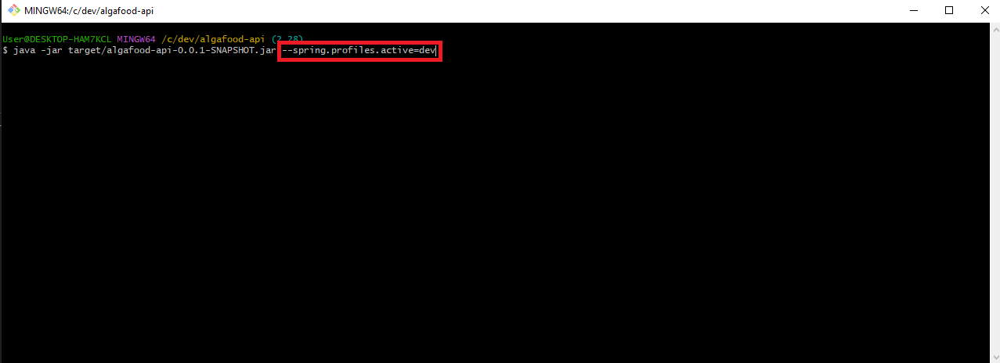

Com o programa rodando, confirmamos o ambiente ativo
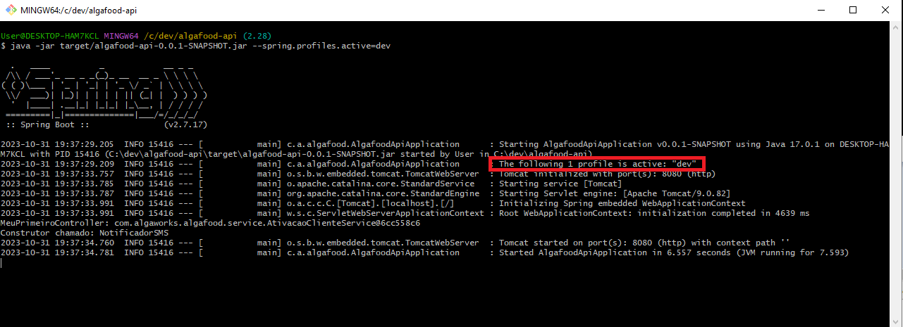

Ao chamar o serviço
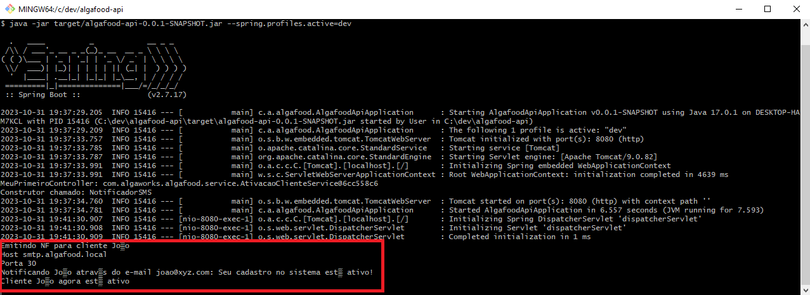

✅ Pela linha de comando, ativando por variável de ambiente (no Mac/Linux ao invés de set, colocar "export")

```
set SPRING_PROFILES_ACTIVE=dev
```

✅ Para consultar a variável de ambiente:

```
echo $SPRING_PROFILES_ACTIVE
```

## Módulo 3 - Introdução ao JPA e Hibernate

### 3.3. Adicionando JPA e configurando o Data Source

#### Nota para atualização de versão:

Este documento irá te auxiliar a fazer esta aula com a versão 2.7 do Spring Boot e suas dependências.

A partir da versão 2.7.12, é necessário adicionar a seguinte dependência do driver do MySQL no pom.xml:

```
<dependency>
      <groupId>com.mysql</groupId>
      <artifactId>mysql-connector-j</artifactId>
    </dependency>
```

[Documentação do driver JDBC do MySQL](https://dev.mysql.com/doc/connector-j/5.1/en/)


⚠️Analisar alterações: 

📌 Nesta aula, apagamos todas as classes de exemplos das aulas anteriores.

✅ Adicionado o Spring Data JPA;

✅ Configurado no application.properties os dados do banco de dados.


### 3.4. Mapeando entidades com JPA

⚠️ Analisar alterações: 

📌 Nesta aula, foi criada:

✅ Cozinha;

✅ Restaurante;

#### Diagrama de classe


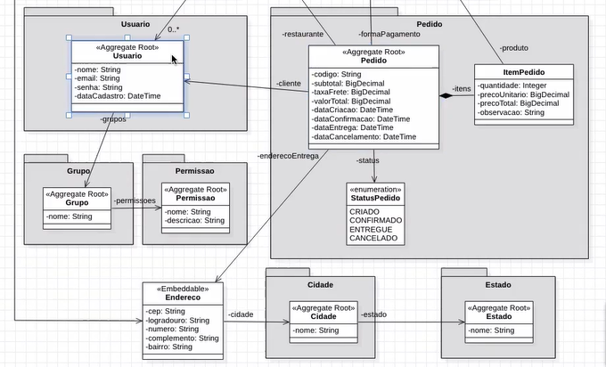

### 3.5. Criando as tabelas do banco a partir das entidades

⚠️ Analisar alterações: 

📌 O que vimos nesta aula:

✅ Sobre as formas de geração das tabelas.

No ambiente de desenvolvimento, a forma mais comum de gerar as tabelas é criando automaticamente pela seguinte configuração no application.propierties:

```
spring.jpa.generate-ddl=true
```

Outra configuração, esta, específica do hibernate, define a forma que seja executado.
Nesta forma (create), dropa todas as tabelas e recria toda vez que reiniciar a aplicação (pode perder dados, recomendado para ambiente de desenvolvimento).

```
spring.jpa.hibernate.ddl-auto=create
```

Já no ambiente de produção, a forma de criar tabelas será demonstrada em outra aula.


### 3.6. Mapeando o id da entidade para autoincremento

📌 O que vimos nesta aula:

✅ Sobre o mapeamento com a anotação @GeneratedValue.

Nesta anotação, inserimos como parâmetro GenerationType.IDENTITY. Esta propriedade significa que estamos passando a responsabilidade de gerar o valor do identificador para o provedor de persistência, ou seja, para o banco de dados:

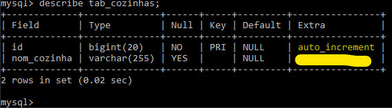


### 3.7. Importando dados de teste com import.sql

📌 O que vimos nesta aula:

✅ Sobre a inserção de dados via arquivo .sql no banco de dados.

Consultando os dados através do comando:

```
select * from cozinha;
```

### 3.15. Conhecendo e usando o Lombok

📌 Usando Lombok, uma biblioteca Java. 

[Projeto Lombok](https://projectlombok.org/)


### 3.16 Desafio: Lombok e repositório de restaurantes

Realizado o Desafio.

### 3.17. Mapeando relacionamento com @ManyToOne

📌 O que vimos nesta aula:

✅ Mapeamento do relacionamento @ManyToOne na entidade Restaurante, onde a leitura correta é "MUITOS restaurantes contém UMA Cozinha". 

✅ A configuração do dialeto do banco de dados, fazendo uma consulta através do buscador da IDE, inserindo o nome do banco de dados, no nosso caso Mysql, para consultar o pacote e o nome da classe.

✅ Com os dados, configuração no application.properties:

```
spring.jpa.properties.hibernate.dialect=org.hibernate.dialect.MySQL57Dialect
```

Esta configuração serve para que o hibernate use o dialeto do MySQL.

✅ Alteração no import.sql.

✅ Testando mudanças através da classe BuscaRestauranteMain.

### 3.20. Desafio: mapeando entidades

#### Diagrama


## MÓDULO 4 - REST COM SPRING

### 4.1. O que é REST?

API REST, também chamada de API RESTful, é uma interface de programação de aplicações (API ou API web) em conformidade com as restrições do estilo de arquitetura REST, permitindo a interação com serviços web RESTful. REST é a sigla em inglês para "Representational State Transfer", que em português significa tansferência de estado representacional. Essa arquitetura foi criada pelo cientista da computação Roy Fielding.

Vantagens: 

    ✅ Separação de cliente e servidor;
    ✅ Escalabilidade;
    ✅ Independência de linguagem;
    ✅ Mercado;

[Artigo sobre API REST](https://www.ibm.com/br-pt/topics/rest-apis)


### 4.2. Conhecendo as constraints do REST

✅ Cliente-servidor: deve ser uma aplicação com clientes e servidores separados.

✅ Stateless server: o servidor não deve guardar informações sobre o estado do cliente. Cada requisição deve ser independente, contendo as informações necessárias para ser atendida.

✅ Cacheable: é necessário que as respostas possam ser cacheadas, e o cliente deve ser informado sobre as propriedades de cache de um recurso a fim de decidir quando utilizar cache ou não.

✅ Interface uniforme: deve existir uma interface uniforme entre cliente e servidor. Para tanto, algumas convenções devem ser seguidas:

    1. Identificação de recursos por URI: cada recurso deve possuir sua respectiva URI de acesso
    2. Manipulação de recursos a partir de suas representações (que podem ser em formato HTML, XML, JSON, TXT, etc)
    3. Mensagens auto-descritivas
    4. Hypermedia as the engine of application state (HATEOAS): as respostas devem conter todas as informações necessárias para que o cliente possa navegar pela aplicação
✅ Sistema em camadas: a aplicação deve ser composta por camadas de fácil alteração, sendo possível adicionar ou remover camadas.

✅ Código sob demanda (opcional): o cliente pode solicitar um código do servidor e executá-lo.

[Artigo sobre as constraints](https://www.dio.me/articles/o-que-e-rest)

[Documentação da API REST do GitHub](https://docs.github.com/pt/rest?apiVersion=2022-11-28)
### 4.3. Diferença entre REST e RESTful

[Ver artigo](https://blog.geekhunter.com.br/sua-api-nao-e-restful-entenda-por-que/)

### 4.4. Desenvolvedores de REST APIs puristas e pragmáticos

### 4.5. Conhecendo o protocolo HTTP

 [Veja esta documentação](https://developer.mozilla.org/pt-BR/docs/Web/HTTP/Overview)

 ### 4.6. Usando o protocolo HTTP

#### Instalando o GnuTLS no Windows

Acesse [este link](https://gnutls.org/), faça download do arquivo de instalação (ZIP) para Windows e descompacte o arquivo em uma pasta.

⚠️ Este programa é apenas para meios didáticos para entender o protocolo HTTP, não sendo obrigatória a instalação.

### 4.7. Instalando e testando o Postman

[Postman](https://www.getpostman.com/)

[Documentação usada na aula](https://docs.github.com/pt/rest?apiVersion=2022-11-28)

### 4.8. Entendendo o que são Recursos REST

Um resource é qualquer coisa exposto na web.

### 4.9. Identificando recursos REST

URI vs URL: 

URI significa Uniform Resource Identifier. É um conjunto de caracteres que tem como objetivo de dar um endereço para os objetos de forma não ambígua.
A URI deve se referenciar a um substantivo. Por exemplo:
    
    /produtos

Para buscar um único produto, seria da seguinte forma:
Ex.: /produtos{codigo}

    /produtos/331

URL significa Uniform Resource Locator. É um tipo de identificador de recurso também, ela especifica não apenas o identificador, mas a localização do recurso também.

A URL completa por exemplo, seria assim:

    https://api.algamarket.com.br/produtos

    
### 4.10. Modelando e requisitando um Collection Resource com GET

⚠️ Alterando o localhost no Windows:

    C:Windows/System32/drivers/etc

Abra o arquivo hosts no bloco de notas e insira, por exemplo:

    #	127.0.0.1       localhost
    #	127.0.0.1       api.algafood.local ⚠️


### 4.13. Implementando content negotiation para retornar JSON ou XML

✅ Foi preciso adicionar uma dependência que é uma extensão do Jackson para serialização de objeto Java para XML.

        <dependency>
            <groupId>com.fasterxml.jackson.dataformat</groupId>
            <artifactId>jackson-dataformat-xml</artifactId>
        </dependency>

### 4.14. Consultando Singleton Resource com GET e @PathVariable

Singleton Resource significa quando o usuário quer buscar apenas um objeto específico no BD.

### 4.15. Customizando as representações XML e JSON com @JsonIgnore, @JsonProperty e @JsonRootName

    ✅ @JsonIgnore: Para caso, queira ignorar algum atributo específico no BD;

    ✅ @JsonProperty: Alterar a nomeclatura do atributo/propriedade sem modificar no atributo em si;

    ✅ @JsonRootName: Para customizar a nomeclatura da entidade que é exibida no BD.


### 4.16. Customizando a representação em XML com Wrapper e anotações do Jackson

Existe a possibilidade de customizar a representação em XML.

✅ Para isso, precisamos criar um método no controller, listarXml(), para que podemos customizar a representação no formato XML.

✅ Criamos uma classe "CozinhasXmlWrapper" para que seja a responsável em fazer o empacotamento das listas de "Cozinhas".

Por enquanto a representação está da seguinte forma:

```
<CozinhasXmlWrapper>
    <cozinhas>
        <cozinhas>
            <id>1</id>
            <titulo>Tailandesa</titulo>
        </cozinhas>
        <cozinhas>
            <id>2</id>
            <titulo>Indiana</titulo>
        </cozinhas>
    </cozinhas>
</CozinhasXmlWrapper>
```

Observe que está um pouco confuso. Com as customizações:

✅ @JacksonXmlRootElement: Esta anotação na classe "CozinhasXmlWrapper", podemos customizar inserindo como parâmetro "cozinhas", para que na representação deixe de mostrar o nome da entidade;

✅ @JsonProperty: No atributo da classe,inserimos esta anotação para passarmos como parâmentro a customização ("cozinha"), para que seja representado cada objeto da lista.  

✅ @JacksonXmlElementWrapper: Inserimos também no método esta anotação para passar como parâmentro o userWrapping = false, para desabilitarmos a representação do empacotamento/embrulho, fazendo com que a representação fique mais sucinta.

📌 A representação em xml com estas alterações ficam da seguinte forma:


```
<cozinhas>
    <cozinha>
        <id>1</id>
        <titulo>Tailandesa</titulo>
    </cozinha>
    <cozinha>
        <id>2</id>
        <titulo>Indiana</titulo>
    </cozinha>
</cozinhas> 
```

### 4.17. Conhecendo os métodos HTTP

📌 Conceito Idempotência

A idempotência é um conceito da área de matemática e ciência da computação, que se refere à possibilidade de uma determinada operação ser aplicada múltiplas vezes e, em todas elas, obter um único resultado.

⚠️ Principais métodos HTTP:

✅ Get;

✅ Post;

✅ Put;

✅ Patch; 

✅ Delete;

✅ Head;

✅ Options.


### 4.18. Conhecendo os códigos de status HTTP

⚠️ Status HTTP.

✅ Nível 200: Significa que o recurso foi processado com sucesso;

✅ Nível 201: Significa que o recurso foi criado com sucesso;

✅ Nível 204: Sem conteúdo. Significa que o recurso foi processado com sucesso, sem a necessidade de resposta. Exemplo, a exclusão com sucesso;

✅ Nível 301: Movido permanentemente;

✅ Nível 302: Encontrado;

✅ Nível 400: Significa requisição mal feita;

✅ Nível 401: Não autorizado;

✅ Nível 403: Proibido;

✅ Nível 404: Não encontrado;

✅ Nível 405: Método não permitido;

✅ Nível 406: Não aceito;

✅ Nível 500: Significa erro no servidor (responsabilidade do dev);

✅ Nível 503: Serviço indisponível;


[Registro oficial IANA de códigos de status HTTP](https://www.iana.org/assignments/http-status-codes/http-status-codes.xhtml)

[Documentação de códigos de status HTTP no MDN](https://developer.mozilla.org/pt-BR/docs/Web/HTTP/Status)


### 4.19. Definindo o status da resposta HTTP com @ResponseStatus

📌 Nesta aula, vimos uma maneira de inserir no método os métodos HTTP através da anotação @ReponseStatus() passando como parâmetro o status desejado. Exemplo: no método de salvar um recurso, o parâmetro seria o HttpStatus.CREATED.

### 4.20. Manipulando a resposta HTTP com ResponseEntity

📌 Alguns exemplos de implementação usando ResponseEntity, e HttpHeaders.

### 4.21. Corrigindo o Status HTTP para resource inexistente

📌 Alguns exemplos de implementação usando ResponseEntity, e Not Found.

### 4.22. Status HTTP para collection resource vazia: qual usar?

📌 O certo é o status ser 200 mesmo, pois o recurso está apenas vazio, ou seja, quando chamamos um serviço de lista de cozinhas, se este não contém dados, o serviço foi chamado com sucesso, apenas está com a lista vazia, sendo assim, o retorno 200 é considerado o mais correto.

### 4.23. Modelando e implementando a inclusão de recursos com POST

### 4.24. Negociando o media type do payload do POST com Content-Type

📌 Na aula vimos que podemos passar no postman, no Header o Content-Type e o Accept, para recebermos e enviarmos os dados como xml, ou json.

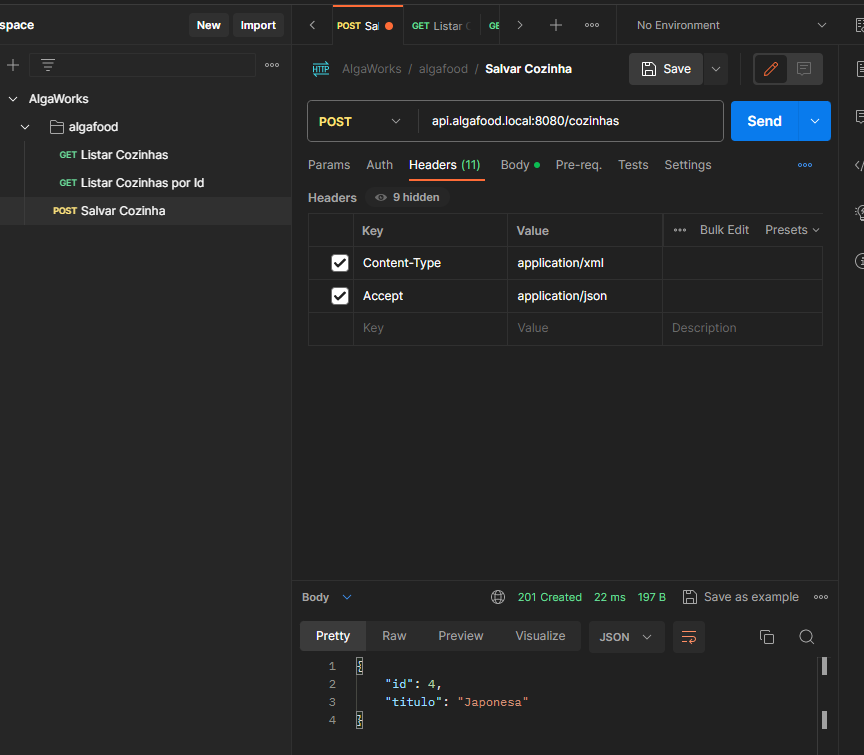

### 4.25. Modelando e implementando a atualização de recursos com PUT

📌 Nesta aula, conhecemos a classe BeanUtils do pacote springframework. Utilizamos o método copyProperties() e passamos três parâmetros.

O método copyProperties de BeanUtils do springfamework faz o mesmo que o seguinte comando: 
```
    cozinhaPersistida.setNome(cozinha.getNome());
```

Ele copia os dados do primeiro paramentro e salva no segundo paramentro, o terceiro parametro passamos uma propriedade que não queremos que seja alterada, no caso o ID (precisa ser como string). Bom para quando temos mtas propriedades.

```
    BeanUtils.copyProperties(cozinha, cozinhaPersistida, "id");
```

O método de atualizar() fica da seguinte forma:

```
@PutMapping("/{cozinhaId}")
    public ResponseEntity<Cozinha> atualizar(@PathVariable Long cozinhaId, @RequestBody Cozinha cozinha){
        Cozinha cozinhaPersistida = cozinhaRepository.buscar(cozinhaId);

        if(cozinhaPersistida != null){
        BeanUtils.copyProperties(cozinha, cozinhaPersistida, "id");
            
        cozinhaRepository.salvar(cozinhaPersistida);

        return ResponseEntity.ok(cozinhaPersistida);
    }

    return ResponseEntity.notFound().build();

}
```

### 4.26. Modelando e implementando a exclusão de recursos com DELETE

Nesta aula vimos sobre o método de remover(). Nos deparamos com um problema onde ao excluir um objeto que tem vínculo com outro objeto, dá um erro de integridade.
Por exemplo, no teste, a cozinha "Tailandesa" tem uma CONSTRAINTS com a tabela de restaurante.

📌 Solução:

✅ Inserimos um try-catch no método, e no catch, usamos a exception "DataIntegrityViolationException", retornando com status HttpStatus.CONFLICT, que é o status 409.

⚠️ O status 400 (Bad Request) também seria correto, mas ele é mais abrangente.

⚠️ Ao usar o status 409(Conflict), é bom retornar um corpo descrevendo qual foi o problema que gerou o conflito. Este problema, veremos na aula sobre modelagem de erro/problema e tratamento de exceptions.


### 4.27. Implementando a camada de domain services (e a importância da linguagem ubíqua)

Neste conceito de DDD, não é interessante o controller realizar modificações no estado da aplicação. A ideia é criar uma outra classe para que faça isso.

📌 Sobre o DDD

O Domain-Driven Design, ou DDD, foi criado para ajudar equipes a ter mais sucesso no desenvolvimento de software com alta qualidade. Quando implementado corretamente, o DDD entrega um design que traduz exatamente como o dominio funciona.

✅ O que é DDD? 

“É um conjunto de princípios com foco em domínio, exploração de modelos de formas criativas e definir e falar a linguagem Ubíqua, baseado no contexto delimitado.”

✅ Linguagem ubíqua 

Um dos pontos mais importantes do DDD, onde 99% das pessoas acabam ignorando, que é falar e extrair a linguagem Ubíqua.

Linguagem Ubíqua é a linguagem falada no dia dia, no contexto da empresa. É a linguagem que utiliza as terminologias da realidade do negócio.

[Mais sobre o DDD](https://fullcycle.com.br/domain-driven-design/)
[Mais sobre o DDD no stackoverflow](https://pt.stackoverflow.com/questions/19548/o-que-realmente-%C3%A9-ddd-e-quando-ele-se-aplica)

### 4.28. Refatorando a exclusão de cozinhas para usar domain services

📌 Ver modificações desta aula no git.

### 4.29. Desafio: modelando e implementando a consulta de recursos de restaurantes

✅ [Acesse aqui o desafio realizado.](https://github.com/danicoln/algafood-api/pull/31/commits/dc3edcc2e8f113fa41f3809aab42ce0569bd112a)

### 4.30. Modelando e implementando a inclusão de recursos de restaurantes

#### Método salvar() de RestauranteService

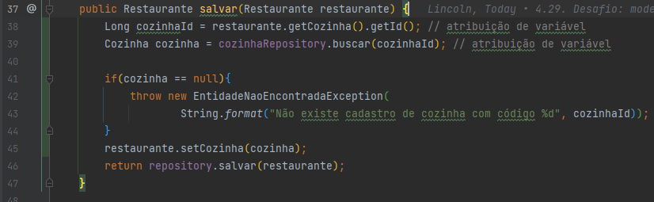

#### Método salvar() de RestauranteController

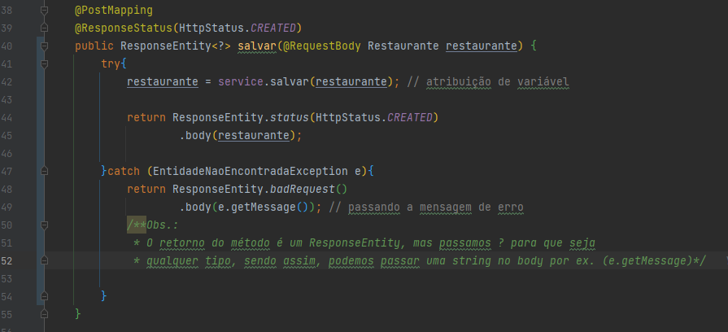


### 4.31. Desafio: Modelando e implementando a atualização de recursos de restaurantes


#### 1 - Criando o método de atualização em RestauranteControlle
Vamos definir a assinatura e anotações referentes ao método que irá atualizar os restaurantes

Receberemos um parâmetro do tipo Long, que será o ID do restaurante a ser atualizado. Esse parâmetro virá pela URL.

Também precisaremos do corpo da requisição, ou seja os dados do Restaurante, para atualizarmos.

O verbo HTTP que iremos utilizar, será o PUT.

```
@PutMapping("/{restauranteId}")
    public ResponseEntity<?> atualizar(@PathVariable Long restauranteId,
            @RequestBody Restaurante restaurante) {
    }
```
✅ Utilizamos @PathVariable para especificar que o parâmetro fará parte da URL

✅ @RequestBody para obter esses valores do body da requisição.

✅ @PutMapping para mapear nosso endpoint para esse verbo, com esse path.

#### 2 - Implementando o método

```
 @PutMapping("/{restauranteId}")
    public ResponseEntity<?> atualizar(@PathVariable Long restauranteId,
        @RequestBody Restaurante restaurante) {
        try {
            Restaurante restauranteAtual = restauranteRepository.buscar(restauranteId);
            
            if (restauranteAtual != null) {
                BeanUtils.copyProperties(restaurante, restauranteAtual, "id");
                
                restauranteAtual = cadastroRestaurante.salvar(restauranteAtual);
                return ResponseEntity.ok(restauranteAtual);
            }
            
            return ResponseEntity.notFound().build();
        
        } catch (EntidadeNaoEncontradaException e) {
            return ResponseEntity.badRequest()
                    .body(e.getMessage());
        }
    }
```

✅ Fizemos já o tratamento, caso não exista um Restaurante com o ID recebido no parâmetro

✅ Fazemos o tratamento do objeto e chamamos o método salvar. Se tudo correr bem, um código 200 será retornado.

### 4.32. Desafio: implementando serviços REST de cidades e estados


### 4.33. Analisando solução para atualização parcial de recursos com PATCH


### 4.34. Finalizando a atualização parcial com a API de Reflections do Spring

📌 Nesta aula, focamos no método merge() de RestauranteController.

A função deste método é "mesclar" o valor 1 (dadosOrigem) para o valor 2 (restauranteDestino).

✅ Utilizamos o ObjectMapper do pacote Jackson, é responsável por serializar(converter)objetos java em json e vice versa.

✅ Convertemos os dadosOrigem para um tipo Restaurante com a seguinte linha de código:

```
    private void merge(Map<String, Object> dadosOrigem, Restaurante restauranteDestino) {
        Restaurante restauranteOrigem = objectMapper.convertValue(dadosOrigem, Restaurante.class);

```

✅ Atribuimos as propriedades à variável dadosOrigem e usamos Field do Java Lang, para representar um atributo da classe Restaurante que iremos modificar. 

✅ Com o método getField(), buscamos o valor da propriedade representada pela variável field e passamos para a variavel restauranteOrigem a variável novoValor já está convertida para o tipo Restaurante.

✅ O ReflectionUtils inspeciona os objetos java e altera em tempo de execução

```
        dadosOrigem.forEach((nomePropriedade, valorPropriedade) -> {
            
        Field field = ReflectionUtils.findField(Restaurante.class, nomePropriedade);
        field.setAccessible(true);

        Object novoValor = ReflectionUtils.getField(field, restauranteOrigem);

        ReflectionUtils.setField(field, restauranteDestino, novoValor);

    });

```

### 4.35. Introdução ao Modelo de Maturidade de Richardson (RMM)


[Para saber mais](https://martinfowler.com/articles/richardsonMaturityModel.html)

[Outras fontes](https://www.dio.me/articles/modelo-de-maturidade-richardson)

[RFC2616: Hypertext Transfer Protocol-- HTTP/1.1](https://datatracker.ietf.org/doc/html/rfc2616)

[RFC7231: Hypertext Transfer Protocol (HTTP/1.1): Semantics and Content](https://datatracker.ietf.org/doc/html/rfc7231)

[RESTful WebAPIs: Services for a Changing World](https://www.amazon.com/RESTful-Web-APIs-Services-Changing/dp/1449358063)

[REST in Practice: Hypermedia and Systems Architecture](https://www.amazon.com.br/REST-Practice-Jim-Webber/dp/0596805829)


## MÓDULO 5 - Super poderes do Spring Data JPA

### 5.1. Implementando consultas JPQL em repositórios

### 5.2. Conhecendo o projeto Spring Data JPA (SDJ)

[Documentação do Spring Data JPA](https://spring.io/projects/spring-data-jpa)

### 5.3. Criando um repositório com Spring Data JPA (SDJ)

### 5.4. Refatorando o código do projeto para usar o repositório do SDJ

[Sobre o Optional](https://blog.algaworks.com/chega-de-nullpointerexception/)

#### Sobre o EmptyResultDataAccessException

Devido a atualização de versão, o JPA não lança mais EmptyResultDataAccessException quando o id buscado não existe no momento realizar a deleção com o deleteById(), ele simplesmente não deleta e não avisa sobre o fato de não existir, por tanto, para que possamos manter o mesmo comportamento demonstrado na aula, vamos alterar o método excluir() para o seguinte:

```
public void excluir(Long cozinhaId) {
        try {
                if (!cozinhaRepository.existsById(cozinhaId)) {
                throw new EntidadeNaoEncontradaException(
                        String.format("Não existe um cadastro de cozinha com código %d", cozinhaId));
                }
            cozinhaRepository.deleteById(cozinhaId);
            
        } catch (DataIntegrityViolationException e) {
            throw new EntidadeEmUsoException(
                String.format("Cozinha de código %d não pode ser removida, pois está em uso", cozinhaId));
        }
    }
```

### 5.6. Criando consultas com query methods

### 5.7. Usando as keywords para definir critérios de query methods

[Documentação do Spring Data JPA: Keywords de query methods](https://docs.spring.io/spring-data/jpa/docs/current/reference/html/#jpa.query-methods.query-creation)

### 5.8. Conhecendo os prefixos de query methods

### 5.9. Usando queries JPQL customizadas com @Query

### 5.10. Externalizando consultas JPQL para um arquivo XML

[GitHub Gist da estrutura do arquivo orm.xml](https://gist.github.com/thiagofa/35d5a651a39cb0b26f050dc3b1ce8f9b)

### 5.11. Implementando um repositório SDJ customizado

[Declaração de variáveis com "var"](https://www.infoq.com/br/articles/java-10-var-type/)

#### Sobre o método customizado:

#### Teste no controller
```
@GetMapping("/restaurantes/por-nome-e-frete")
    public List<Restaurante> restaurantesPorNomeFrete(String nome,
                                                      BigDecimal taxatFreteInicial, BigDecimal taxaFreteFinal) {
        return restauranteRepository.find(nome, taxatFreteInicial, taxaFreteFinal);
    }
```

#### Interface RestauranteRepository
```
    List<Restaurante> find(String nome, BigDecimal taxaFreteInicial, BigDecimal taxaFreteFinal);
```

📌 O spring data JPA entende que o método find de RestauranteRepository se refere à um método customizado. Então, ele chama o médodo do RestauranteRepositoryImpl. É importante entender que é preciso ter o prefixo "Impl" para que o SDJ entender que se refere a uma classe customizada.

#### RestauranteRepositoryImpl
```
public List<Restaurante> find(String nome,
                                  BigDecimal taxaFreteInicial, BigDecimal taxaFreteFinal){

        var jpql = "from Restaurante where nome like :nome " +
                "and taxaFrete between :taxaIniial and :taxaFinal";

        return manager.createQuery(jpql, Restaurante.class)
                .setParameter("nome", "%" + nome + "%")
                .setParameter("taxaInicial", taxaFreteInicial)
                .setParameter("taxaFinal", taxaFreteFinal)
                .getResultList();
```

#### Desvantagem

Com a implementação dessa forma, não existe um vínculo muito forte dos métodos. Pois, uma mudança no método da classe Impl, pode causar problema no Repository.

A solução é extrair o método de RestauranteRepositoryImpl para uma interface, por exemplo RestauranteRepositoryQueries e colocamos no pacote repository do pacote de domínio. 

```
package com.algaworks.algafood.domain.repository;

import com.algaworks.algafood.domain.model.Restaurante;

import java.math.BigDecimal;
import java.util.List;

public interface RestauranteRepositoryQueries {
    List<Restaurante> find(String nome,
                           BigDecimal taxaFreteInicial, BigDecimal taxaFreteFinal);
}
```

Assim, extendemos também o RestauranteRepository para o RestauranteRepositoryQueries, com isso o RestauranteRepository herda o método de RestauranteRepositoryQueries.

### 5.12. Implementando uma consulta dinâmica com JPQL

📌 Ver registros das atividades.

### 5.13. Implementando uma consulta simples com Criteria API

### 5.14. Adicionando restrições na cláusula where com Criteria API

### 5.15. Tornando a consulta com Criteria API com filtros dinâmicos

📌 Implementação de consulta dinâmica com Criteria. 


### 5.16. Conhecendo o uso do padrão Specifications (DDD) com SDJ

Para entender melhor, encontrei [este blog](https://www.anselme.com.br/2023/04/05/specification-pattern-no-domain-driven-design/) que fala um pouco sobre este assunto. 

### 5.17. Implementando Specifications com SDJ

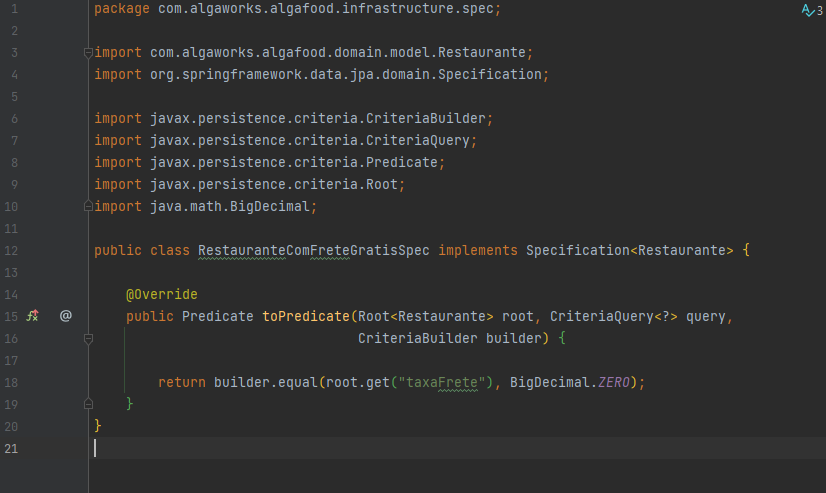

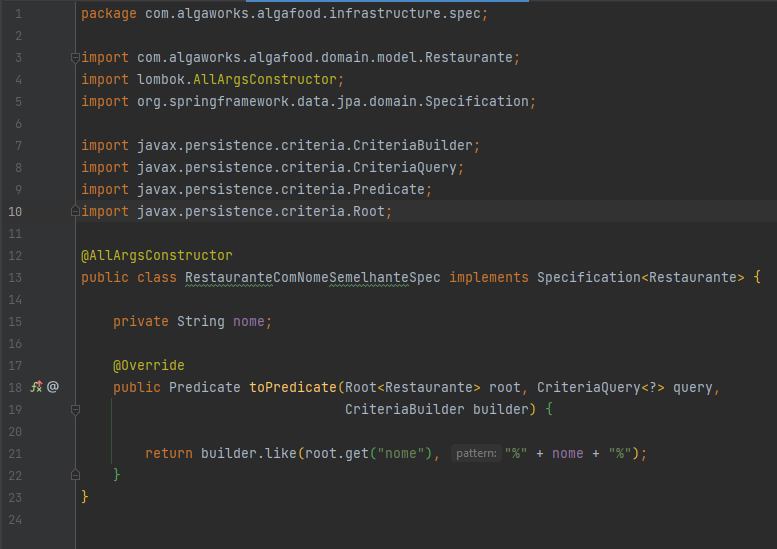

Para testar, criamos o método a seguir:
```
@GetMapping("/restaurantes/com-frete-gratis")
    public List<Restaurante> restaurantesComFreteGratis(String nome) {

        var comFreteGratis = new RestauranteComFreteGratisSpec();
        var comNomeSemelhante = new RestauranteComNomeSemelhanteSpec(nome);

        return restauranteRepository.findAll(comFreteGratis.and(comNomeSemelhante));
    }
```

Para que o método findAll funcione, temos que inserir um implements no RestauranteRepository com <code>JpaSpecificationExecutor<code><</code><code>Restaurante</code><code>></code></code>.

### 5.18. Criando uma fábrica de Specifications


📌 No Eclipse, é necessário configurar o import em "Preferences" / "Favorites", inserir o pacote da classe estática. Assim, o Eclipse define uma lista de classes de pacotes statics.

### 5.19. Injetando o próprio repositório na implementação customizada e a anotação @Lazy

### 5.20. Estendendo o JpaRepository para customizar o repositório base

📌 Na nossa classe AlgafoodApiApplication, anotamos com @EnableJpaRepositories. Com essa anotação, customizamos uma propriedade repositoryBaseClass. Nesta propriedade, inserimos a classe base, precisa ser a nossa Impl. Desta forma, substituímos a implementação do repositório base, dexando ser de SimpleJpaRepository para CustomJpaRepository

## MÓDULO 6 - Explorando Mais do JPA e Hibernate

### 6.1. Mapeando relacionamento bidirecional com @OneToMany

✅ Em mapeamentos bidirecionais entre entidades em frameworks de persistência de dados, como JPA (Java Persistence API) para bancos de dados relacionais, pode ocorrer um problema conhecido como "loop infinito" ou "referência cíclica". Isso acontece quando duas entidades referenciam uma à outra de forma bidirecional, e durante o processo de serialização para JSON, por exemplo, o sistema entra em um loop infinito tentando serializar as referências cruzadas. 

✅ Para resolver esse problema, geralmente você precisa escolher um lado da relação para ser o lado "proprietário" e usar a anotação @JsonIgnore ou outras estratégias para evitar a serialização infinita. Por exemplo, você pode fazer com que a entidade B seja o lado proprietário e marcar a lista de A com @JsonIgnore.

✅ O mapeamento @JsonIgnore é uma anotação usada em Java, especialmente em contextos de desenvolvimento de APIs usando frameworks como o Jackson (usado para serialização/deserialização de objetos Java para JSON) ou similares. Essa anotação é aplicada a campos, métodos ou classes para indicar que determinada propriedade deve ser ignorada durante o processo de serialização (conversão de um objeto Java para JSON).

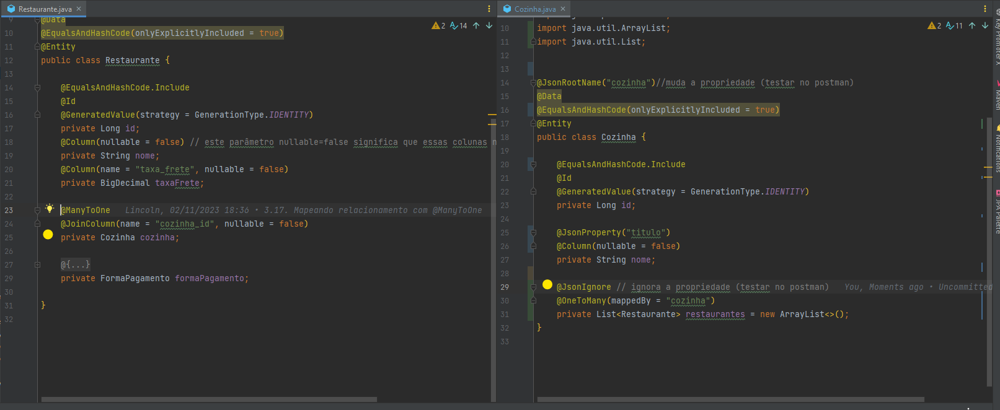

### 6.2. Mapeando relacionamento muitos-para-muitos com @ManyToMany

✅ A anotação @ManyToMany é usada em Java, especialmente em frameworks de persistência como JPA, para mapear um relacionamento muitos-para-muitos entre duas entidades. Ela indica que uma entidade pode estar associada a várias instâncias da outra entidade, e vice-versa. No contexto do banco de dados, isso geralmente é implementado através de uma tabela intermediária que armazena os pares de chaves estrangeiras das entidades envolvidas no relacionamento.

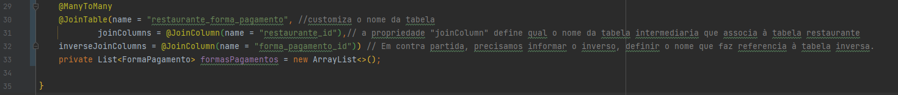

### 6.3. Analisando o impacto do relacionamento muitos-para-muitos na REST API

✅ É necessário analisar com cuidado sobre as informações que desejamos apresentar na representação, por exemplo, nossa lista de restaurantes, não precisamos apresentar todas as formas de pagamentos. Para isso, adicionamos a anotação @JsonIgnore no nosso atributo formasPagamentos, com isso, não sera representado formas de pagamentos na listagem de Restaurante.

### 6.4. Mapeando classes incorporáveis com @Embedded e @Embeddable

✅ Componentizar algumas entidades, muitas vezes é necessário. Por exemplo, endereço. Criamos uma classe apenas para os dados de endereço, para poder separar negócios de restaurante no caso. Neste caso, a classe endereço não é considerada uma Entidade.

### 6.5. Testando e analisando o impacto da incorporação de classe na REST API

✅ Da mesma forma que na aula 6.3, é necessário analisar com cuidado sobre as informações passadas na collection resource. Assim, inserimos a anotação @JsonIgnore. Numa aula futura, iremos aprender como melhorar essas representações.

### 6.6. Mapeando propriedades com @CreationTimestamp e @UpdateTimestamp

✅ A anotação "@CreationTimestamp" e "@UpdateTimestamp" é uma implementação do Hibernate, não do JPA. Um é para criação e outro é para atualização. 

✅ Utilizamos na anotação @Column uma propriedade chamada columnDefinition, e passamos o valor "datetime" para que os milisegundos não apareça.

### 6.7. Desafio: mapeando relacionamento muitos-para-um

[Ver Issue](https://github.com/danicoln/algafood-api/issues/53)

### 6.8. Desafio: mapeando relacionamento um-para-muitos

[Ver Issue](https://github.com/danicoln/algafood-api/pull/57)

### 6.9. Desafio: mapeando relacionamentos muitos-para-muitos

[Ver Issue](https://github.com/danicoln/algafood-api/pull/58)

### 6.10. Entendendo o Eager Loading

Todas as associações que terminam com "ToOne", usam por padrão estratégia Eager Loading, ou seja, um carregamento ansioso/antecipado. Todas vez que uma instância for carregada a partir do banco de dados, irá carregar também as associações que usam Eager Loading.

📌 [Diferença entre inner join e left join](https://pt.stackoverflow.com/questions/6441/qual-%C3%A9-a-diferen%C3%A7a-entre-inner-join-e-outer-join)

#### Eager Loading
É o Load aonde todas as classes relacionadas são carregadas na mesma query. O ORM, normalmente por meio de Joins, trará todas as entidades relacionadas.

### 6.11. Entendendo o Lazy Loading
Todas as associações que terminam com "ToMany", usam por padrão estratégia Lazy Loading, ou seja, um carrgamento preguiçoso.

#### Lazy Loading
É um carregamento preguiçoso, quando você executa uma consulta por uma certa Entidade suas relações não são carregadas em memória pela consulta inicial, no entanto, ao executar algum método que chama esses registros, será executada uma outra consulta para preencher essas entidades relacionadas. Ou seja, Lazy é um carregamento por demanda.

É importante analisar os selects que estão sendo gerados.

### 6.12. Alterando a estratégia de fetching para Lazy Loading

Fizemos um teste no nosso controlador para testarmos o fetch LAZY.
```
public List<Restaurante> listar(){
        List<Restaurante> restaurantes = repository.findAll();
        System.out.println("O nome da cozinha é: ");
        System.out.println(restaurantes.get(0).getCozinha().getNome());
        return restaurantes;
    }
```

No nosso teste de listar Restaurantes, no console podemos verificar que é feita apenas um select na tabela Cozinha.

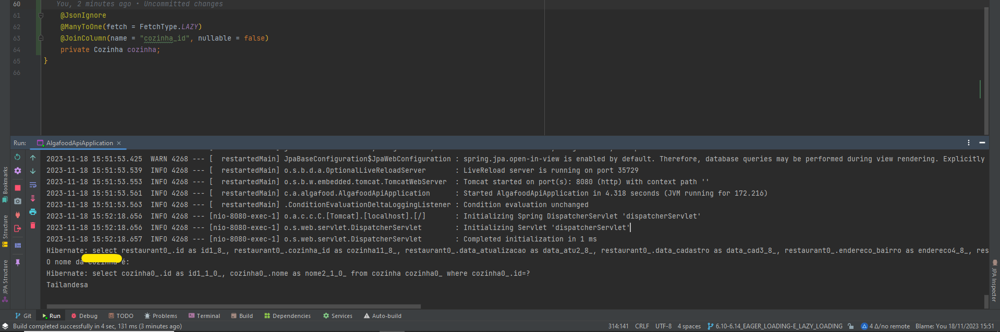

#### Remoção do @JsonIgnore

Com a remoção do @JsonIgnore no atributo cozinha, ao testar dá o seguinte erro:

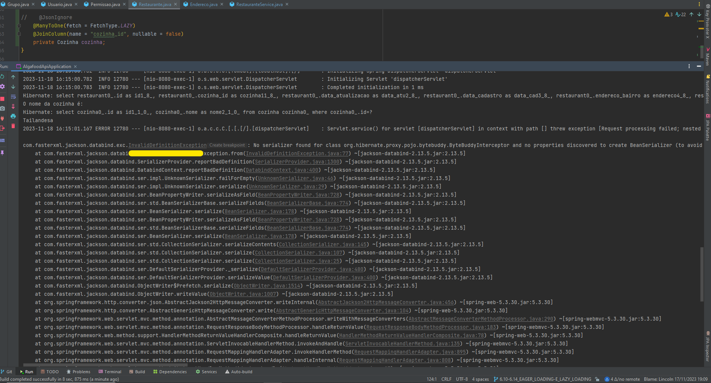

Quando o atributo está LAZY, a implementação do JPA cria uma Classe dinamicamente em tempo de execução e atribui ao atributo "cozinha".

Note na imagem a seguir, que a classe criada pelo JPA se chama "Cozinha$HibernateProxy$8BNbNy8F" passando uma propriedade como parâmetro "hibernateLazyInitializer".
Como o atributo está LAZY, o atributo "cozinha" está null, ou seja, quando é feita a consulta no banco de dados, é seria retornado um NullPointerException, mas como o JPA cria esta classe proxy em tempo de execução, dá este erro.

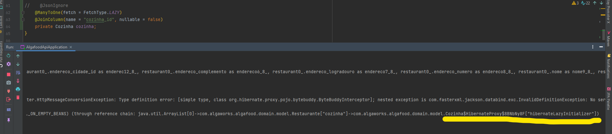

Esta exception, diz que não foi possível serializar um objeto numa representação json, por causa da propriedade "hibernateLazyInitializer". 

#### Solução

Para solucionar este problema, usamos uma anotação @JsonIgnoreProperties e passamos o nome da propriedade de parâmetros. Veja no teste a seguir que no console, fez select para 4 cozinhas vinculadas para cada restaurante.

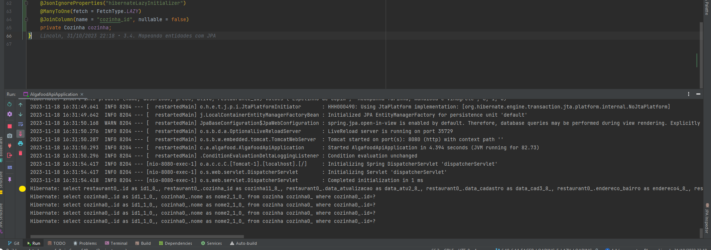

#### Observação:

Neste momento temos 6 restaurantes, mas tem alguns restaurantes usando a mesma cozinha, sendo assim, o hibernate faz apenas um select para cada cozinha.

### 6.13. Alterando a estratégia de fetching para Eager Loading

Veja no exemplo abaixo, que para cada restaurante, o próprio JPA faz o select das formas de pagamento. Temos um problema de N+1. Se tivéssemos 1000 restaurantes, seriam 1000 selects de forma de pagamento para cada restaurante.

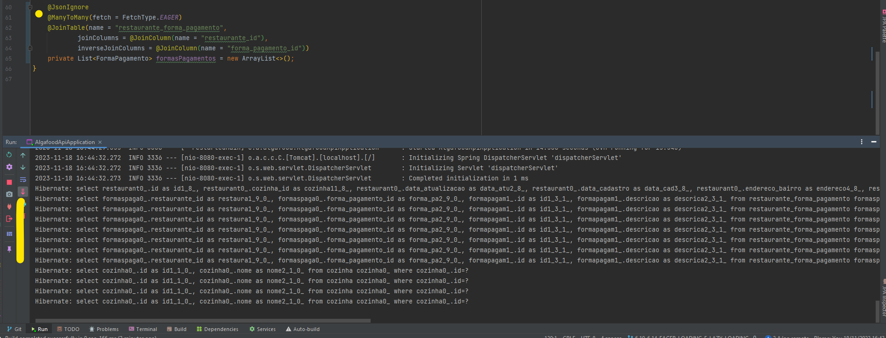

Na prática, geralmente não usamos uma configuração de alterar "ToMany" que é Lazy, para EAGER. Pois pode dar um problemão para a performance do sistema.

### 6.14. Resolvendo o Problema do N+1 com fetch join na JPQL

Para resolver o problema do nosso caso, teremos que implementar o método findAll() do JPA mas de forma customizada. Em RestauranteRepository, fazemos o seguinte:

```
@Query("from Restaurante r join r.cozinha")
List<Restaurante> findAll();
```

Sendo assim, o método busca os restaurante fazendo apenas um select em restaurante.

Para inserir mais uma regra, por exemplo, as formas de pagamentos:

```
@Query("from Restaurante r join r.cozinha left join fetch r.formasPagamentos")
List<Restaurante> findAll();
```

Utilizamos "left join fetch", para caso se algum restaurante não tiver nenhuma forma de pagamento associada a ele.

Sendo assim, é realizado apenas um select na tabela de restaurante. 

Com a utilização de JOIN FETCH, gera um produto cartesiano, uma combinação de registros, podendo ter mais linhas na tabela intermediária.

## MÓDULO 7. POOL DE CONEXÕES E FLYWAY

O pool de conexões, em termos gerais, refere-se a uma técnica usada em programação para otimizar o gerenciamento de conexões com bancos de dados ou outros recursos de rede. A ideia é reutilizar conexões existentes em vez de abrir uma nova a cada vez que uma aplicação precisa se conectar a um banco de dados.

### 7.1. Entendendo o Funcionamento de um Pool de Conexões

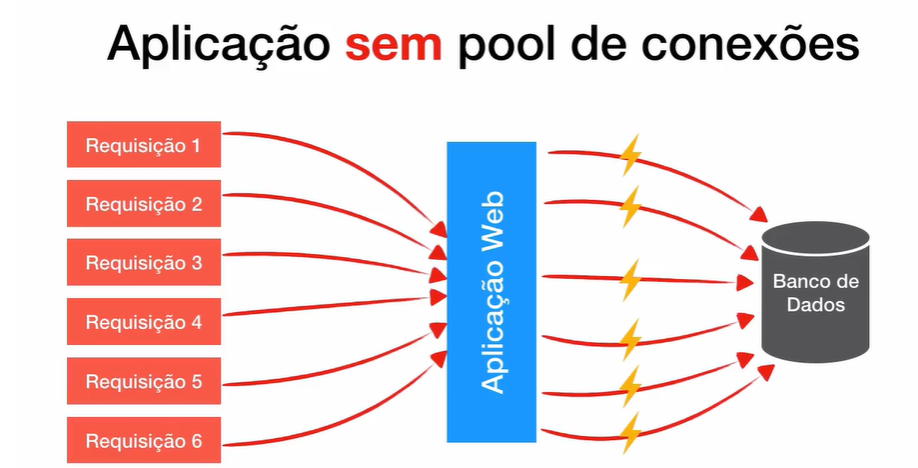

### Aplicação sem o Pool de Conexões:

<ol>
    <li>A aplicação precisa acessar o banco de dados.</li>
    <li>Ela abre uma nova conexão toda vez que precisa executar uma consulta ou atualização.</li>
    <li>Após a operação, a conexão é fechada.</li>
</ol>

### Problemas:

<ul>
    <li>Abrir e fechar conexões repetidamente pode ser demorado e consumir recursos.</li>
    <li>Pode levar a problemas de desempenho devido ao tempo gasto na criação e fechamento de conexões</li>
</ul>

### Aplicação com o Pool de Conexões:

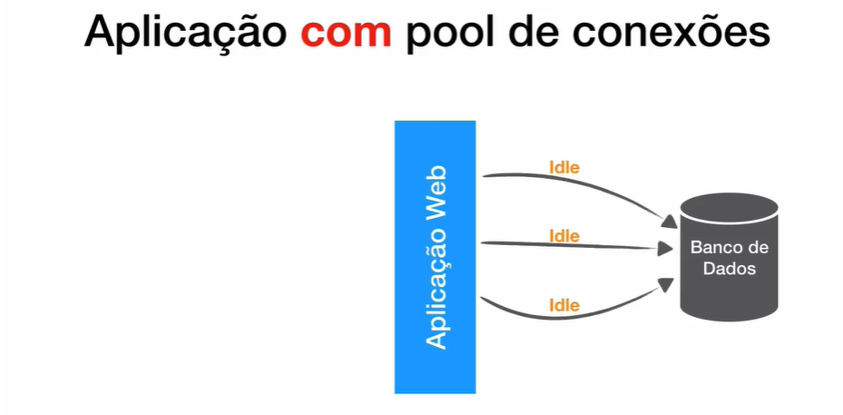


<ol>
    <li>A aplicação solicita uma conexão a partir de um pool (conjunto pré-existente de conexões).</li>
    <li>Quando a operação é concluída, a conexão não é fechada, mas retornada ao pool para uso futuro.</li>
</ol>

### Benefícios:

<ul>
    <li>Redução do tempo de abertura e fechamento de conexões.</li>
    <li>Melhoria no desempenho, já que as conexões são reutilizadas.</li>
    <li>Controle mais eficiente dos recursos de conexão.</li>
</ul>

### 7.2. Conhecendo o Hikari: a solução padrão de pool de conexões no Spring Boot

[Para saber mais sobre o Hikari](https://medium.com/creditas-tech/pool-de-conex%C3%B5es-com-spring-e-postgres-ded983543522#:~:text=O%20HikariCP%20prov%C3%AA%20algumas%20funcionalidades,abertura%20autom%C3%A1tica%20de%20nova%20conex%C3%A3o)

### 7.3. Configurando o pool de conexões do Hikari

📌 Para saber mais, verificar as configurações feitas na aula.

### 7.4. Schema generation em produção não é uma boa prática

📌 Foi falado na aula que não é uma boa prática usar as seguintes configurações no application.properties:

```
spring.jpa.generate-ddl=true
spring.jpa.hibernate.ddl-auto=create
```

O ideal é utilizar ferramentas de versionamento de schemas, como por exemplo o Flyway.

### 7.5. Flyway: ferramenta de versionamento de schemas de banco de dados

#### Como amadores gerenciam as mudanças em schemas do banco de dados

✅ Resumindo a aula, geralmente, o desenvolvedor altera de forma manual as tabelas do banco de dados em algum ambiente, ocasionando um transtorno para o restante da equipe.

#### Como profissionais gerenciam as mudanças em schemas do banco de dados

✅ As criações e alterações de tabelas são feitas através de script de migração utilizando versões, não podendo alterar estes scripts criados.

### 7.6. Adicionando o Flyway no projeto e criando a primeira migração


#### Atualização do Flyway 8

Devido à atualização da dependência do Flyway para a versão 8 no Spring Boot 2.7.0, é necessário adicionar uma dependência a mais do Flyway, dependendo do banco de dados utilizado.

Caso utilize o MySQL, adicione:

```
<dependency>
  <groupId>org.flywaydb</groupId>
  <artifactId>flyway-mysql</artifactId>
</dependency>
```

### 7.7. Evoluindo o banco de dados com novas migrações

#### Criando uma tabela cidade:

Fizemos um teste de script no MySQL Workbanch, para verificar se o script está correto. Estando tudo certo, apagamos a tabela e copiamos o script e inserimos no projeto através do script de migração.

No MySQL:
```
create table cidade (
	id bigint not null auto_increment,
    nome_cidade varchar(80) not null,
    nome_estado varchar(80) not null,
    primary key (id)
) engine=InnoDB default charset=utf8mb4;
```

Apagando a tabela:
```
drop table cidade;
```

### 7.8. Criando migrações complexas com remanejamento de dados

#### Dump de banco de dados

É importante saber, que antes de realizar qualquer migração de um banco de dados, é necessário realizar um backup para que não se perca os dados.

Para fazer um backup do banco de dados, "algafood" no MySQL, use o seguinte comando:
```
mysqldump --host localhost --user root --password --databases algafood > dump.sql
```

Para criar o database "algafood" a partir do dump, execute o comando:

```
mysql --host localhost --user root --password < dump.sql
```

### 7.9. Criando migração a partir de DDL gerado por schema generation

Para os preguiçosos, existe uma forma de criar tabelas inserindo algumas configurações no application.properties:

```
spring.jpa.properties.javax.persistence.schema-generation.scripts.action=create
spring.jpa.properties.javax.persistence.schema-generation.scripts.create-target=src/main/resources/ddl.sql
```
📌 Após subir a aplicação, atualizar o resource para que o arquivo ddl.sql apareça. Mas é extremamente necessário a revisão do arquivo, analisar as criações de tabelas, foreign keys etc, pois vem configurado padrão do jpa.

📌 É importante também, após a criação do arquivo ddl.sql, retirar a configuração no application.properties, pois toda vez que subir a aplicação, será gerado o arquivo ddl.sql.

### 7.10. Adicionando dados de testes com callback do Flyway

📌 Vimos em aulas anteriores que não é uma boa prática a utilização de dados de testes no ambiente de desenvolvimento.

No MySQL, criamos um arquivo com o nome afterMigrate.sql, o Flyway irá entender que este arquivo é de callback, após realizar todas as migrações, o Flyway irá chamar o afterMigrate.sql.

Nos inserts para o MySQL, temos que colocar o "ignore" para que o BD ignore os dados caso dê algum erro.

```
insert ignore into cozinha (id, nome) values (1, 'Tailandesa');
insert ignore into cozinha (id, nome) values (2, 'Indiana');
insert ignore into cozinha (id, nome) values (3, 'Argentina');
insert ignore into cozinha (id, nome) values (4, 'Brasileira');
```

✅ Outra opção, é zerar os dados de todas as tabelas, para caso o dev queira os dados frescos nas tabelas.

Na aula, criamos o arquivo afterMigrate.sql e inserimos os dados abaixo:

```
set foreign_key_checks = 0;

delete from cidade;
delete from cozinha;
delete from estado;
delete from forma_pagamento;
delete from grupo;
delete from grupo_permissao;
delete from permissao;
delete from produto;
delete from restaurante;
delete from restaurante_forma_pagamento;
delete from usuario;
delete from usuario_grupo;

set foreign_key_checks = 1;

alter table cidade auto_increment = 1;
alter table cozinha auto_increment = 1;
alter table estado auto_increment = 1;
alter table forma_pagamento auto_increment = 1;
alter table grupo auto_increment = 1;
alter table permissao auto_increment = 1;
alter table produto auto_increment = 1;
alter table restaurante auto_increment = 1;
alter table usuario auto_increment = 1;

insert into forma_pagamento (id, descricao) values (1, 'Débito');
insert into forma_pagamento (id, descricao) values (2, 'Crédito');
insert into forma_pagamento (id, descricao) values (3, 'Pix');
insert into forma_pagamento (id, descricao) values (4, 'Dinheiro');

insert into cozinha (id, nome) values (1, 'Tailandesa');
insert into cozinha (id, nome) values (2, 'Indiana');
insert into cozinha (id, nome) values (3, 'Argentina');
insert into cozinha (id, nome) values (4, 'Brasileira');


insert into estado (id, nome) values (1, 'São Paulo');
insert into estado (id, nome) values (2, 'Rio de Janeiro');
insert into estado (id, nome) values (3, 'Minas Gerais');

insert into cidade (id, nome, estado_id) values (1, 'Americana', 1);
insert into cidade (id, nome, estado_id) values (2, 'Belo Horizonte', 3);
insert into cidade (id, nome, estado_id) values (3, 'Hortolândia', 1);
insert into cidade (id, nome, estado_id) values (4, 'Rio de Janeiro', 2);

insert into restaurante (id, nome, taxa_frete, cozinha_id, data_cadastro, data_atualizacao, endereco_cidade_id, endereco_cep, endereco_logradouro, endereco_numero, endereco_bairro) values (1, 'Charbon', 9.99, 1, utc_timestamp, utc_timestamp, 1, '38400-999', 'Rua João Pinheiro', '1000', 'Sun Gertrudez');
insert into restaurante (id, nome, taxa_frete, cozinha_id, data_cadastro, data_atualizacao) values (2, 'Matuto', 9.99, 1, utc_timestamp, utc_timestamp);
insert into restaurante (id, nome, taxa_frete, cozinha_id, data_cadastro, data_atualizacao) values (3, 'Madero', 7.50, 1, utc_timestamp, utc_timestamp);
insert into restaurante (id, nome, taxa_frete, cozinha_id, data_cadastro, data_atualizacao) values (4, 'Delivery Foods', 15.50, 2, utc_timestamp, utc_timestamp);
insert into restaurante (id, nome, taxa_frete, cozinha_id, data_cadastro, data_atualizacao) values (5, 'Java Steakhouse', 12, 3, utc_timestamp, utc_timestamp);
insert into restaurante (id, nome, taxa_frete, cozinha_id, data_cadastro, data_atualizacao) values (6, 'Lanchonete do Tio Sam', 11, 4, utc_timestamp, utc_timestamp);
insert into restaurante (id, nome, taxa_frete, cozinha_id, data_cadastro, data_atualizacao) values (7, 'Bar da Maria', 6, 4, utc_timestamp, utc_timestamp);

insert into permissao (id, nome, descricao) values (1, 'CONSULTAR_COZINHAS', 'Permite consultar cozinhas');
insert into permissao (id, nome, descricao) values (2, 'EDITAR_COZINHAS', 'Permite editar cozinhas');

insert into restaurante_forma_pagamento (restaurante_id, forma_pagamento_id) values (1, 1), (1, 2), (1, 3), (2, 3), (3, 2), (3, 3);
insert into restaurante_forma_pagamento (restaurante_id, forma_pagamento_id) values (1, 1), (1, 2), (1, 3), (2, 3), (3, 2), (3, 3), (4, 1), (4, 2), (5, 1), (5, 2), (6, 3);

insert into produto (nome, descricao, preco, ativo, restaurante_id) values ('Porco com molho agridoce', 'Deliciosa carne suína ao molho especial', 78.90, 1, 1);
insert into produto (nome, descricao, preco, ativo, restaurante_id) values ('Camarão tailandês', '16 camarões grandes ao molho picante', 110, 1, 1);

insert into produto (nome, descricao, preco, ativo, restaurante_id) values ('Salada picante com carne grelhada', 'Salada de folhas com cortes finos de carne bovina grelhada e nosso molho especial de pimenta vermelha', 87.20, 1, 2);

insert into produto (nome, descricao, preco, ativo, restaurante_id) values ('Garlic Naan', 'Pão tradicional indiano com cobertura de alho', 21, 1, 3);
insert into produto (nome, descricao, preco, ativo, restaurante_id) values ('Murg Curry', 'Cubos de frango preparados com molho curry e especiarias', 43, 1, 3);

insert into produto (nome, descricao, preco, ativo, restaurante_id) values ('Bife Ancho', 'Corte macio e suculento, com dois dedos de espessura, retirado da parte dianteira do contrafilé', 79, 1, 4);
insert into produto (nome, descricao, preco, ativo, restaurante_id) values ('T-Bone', 'Corte muito saboroso, com um osso em formato de T, sendo de um lado o contrafilé e do outro o filé mignon', 89, 1, 4);

insert into produto (nome, descricao, preco, ativo, restaurante_id) values ('Sanduíche X-Tudo', 'Sandubão com muito queijo, hamburger bovino, bacon, ovo, salada e maionese', 19, 1, 5);

insert into produto (nome, descricao, preco, ativo, restaurante_id) values ('Espetinho de Cupim', 'Acompanha farinha, mandioca e vinagrete', 8, 1, 6);


```

📌 Por algum motivo, não deu certo para mim. Estava dando erro de que a tabela "forma_pagamento" não existe. Mesmo apagando a linha de forma_pagamento, dava outro erro mas idêntico, onde a tabela grupo não existe. 

✅ Inserimos uma configuração para que o spring localize o arquivo em application.properties:

```
spring.flyway.locations=classpath:db/migration,classpath:db/testdata
```

### 7.11. Reparando migrações com erros

Nesta aula vimos algumas formas de reparar erros no Flyway. Uma das formas que não deu certo comigo é por linha de comando com as seguintes propriedades:

```
./mvnw flyway:repair -Dflyway.configFiles=src/main/resources/flyway.properties
```

O erro foi de acesso negado para o usuário "root" onde a senha não estava sendo reconhecida.

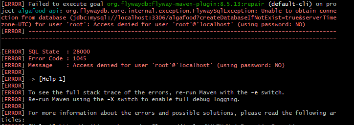

## MÓDULO 8 - TRATAMENTO E MODELAGEM DE ERROS DA API

### 8.1. Introdução ao tratamento e modelagem de erros

### 8.2. Lançando exceções customizadas anotadas com @ResponseStatus

### 8.3. Lançando exceções do tipo ResponseStatusException

Numa classe de domínio, não deveríamos nos preocupar com código de status Http. Esta preocupação é para uma outra camada.
A classe de serviço não sabe nada de código de status de resposta, simplesmente exceções de negócios. Então, em outra classe (no nosso caso, no controller), relançamos a ResponseStatusException.

### 8.4. Estendendo ResponseStatusException

Agora, sabemos como devolver código de status http e a mensagem a partir de exception de duas formas: usando a anotação @ResponseStatus e também a classe de exceção ResponseStatusException.

Nesta aula, aprendemos a simplificar ainda mais.

### 8.5. Simplificando o código com o uso de @ResponseStatus em exceptions

A forma que foi implementada a exception na aula anterior, onde a classe EntidadeNaoEncontradaException extende a ResponseStatusException, é legal para quando precisamos de uma única exception podendo a classe devolver na resposta http diferentes respostas de código HTTP. No nosso caso, especialmente, quem lança essa exceção é a nossa classe de Serviço (CadastroCozinhaService), e não queremos um código de status http dentro de nossa classe de serviço. 

### 8.6. Desafio: refatorando os serviços REST

Ticket - Issue: https://github.com/danicoln/algafood-api/issues/63

Tarefas: https://github.com/danicoln/algafood-api/commit/87b285e1097ecf0cb413c53ba72b28aa0c30674c

### 8.7. Analisando os impactos da refatoração

De acordo com a aula, após as refatorações, nos testes realizados, por exemplo, adicionando uma cidade com um estado inexistente, o código HTTP 404 não é o ideal para este caso. Iremos corrigir isso na próxima aula.

### 8.8. Criando a exception NegocioException

Em nosso CidadeController, no método de atualizar, criamos um TryCatch buscando o EntidadeNaoEncontradaException, e relançando um NegocioException. Assim, este NegocioException retorna o BadRequest status 400. Na camada de controller, não tem problema de trabalharmos com Exception pensando em código de status http.

```
@PutMapping("/{cidadeId}")
    public Cidade atualizar(@PathVariable Long cidadeId,
                                            @RequestBody Cidade cidade) {

        Cidade cidadeAtual = service.buscarOuFalhar(cidadeId);

        BeanUtils.copyProperties(cidade, cidadeAtual, "id");

        try {
            return service.salvar(cidadeAtual);
        } catch (EntidadeNaoEncontradaException e){
            throw new NegocioException(e.getMessage());
        }
    }
```

### 8.10. Afinando a granularidade e definindo a hierarquia das exceptions de negócios

Afinar a granularidade é tratar um problema de forma bem específica ao invés de utilizar uma Exception genérica. 